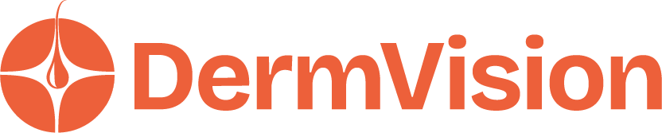

Introduction
============

.. |spacer| raw:: html

   

|spacer|

**DermVision** (/ˈdɜrmˌvɪʒən/) is a SaaS computer-aided assistive diagnostic tool for patients and dermatologists.

.. note::
   This project is under active development.

Core Features
^^^^^^^^^^^^

- **AI-Powered Diagnostics**: DermVision uses state-of-the-art deep learning models to analyze dermatological images. The AI system is trained on a vast dataset of skin images, enabling it to recognize and classify a wide range of skin conditions with high accuracy.
- **Diagnostics Records Management**: The Diagnostics Record Management System (DRMS) in DermVision is a robust tool designed to manage and maintain diagnostic records efficiently. It integrates seamlessly with the AI-assisted diagnostic tools, providing a comprehensive solution for tracking, storing, and analyzing diagnostic data.
- **Patients Records Management**: DermVision offers a robust patient record management system designed to streamline the documentation, retrieval, and analysis of patient information.
- **Clinical Notes Management**: The Clinical Notes Record Management System (CNRMS) within DermVision is designed to streamline the documentation and management of clinical notes, providing healthcare professionals with a centralized, secure, and efficient way to record and access patient information.
- **Prescription Records Management**: The Prescription Record Management System within DermVision is designed to streamline the documentation, management, and tracking of patient prescriptions. This system provides a centralized, secure, and efficient way to manage prescription records, ensuring that healthcare providers can easily access and update prescription information.

Contents
--------

.. toctree::
   Introduction <self>
   getting-started
   system-design
   how-to-guides
   developer-api
